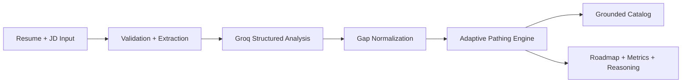

# 5-Slide Deck Content

This file is intentionally limited to the exact 5-slide hackathon structure.

## Slide 1 - Solution Overview

**Title:** CogniSync AI: Adaptive Onboarding Engine

**Key points**

- Corporate onboarding is inefficient because it is static and role-agnostic.
- CogniSync AI compares a candidate's current capability with role requirements.
- The product generates a grounded, personalized onboarding pathway instead of a one-size-fits-all curriculum.
- The outcome is faster ramp-up, less redundant training, and clearer role readiness.

## Slide 2 - Architecture & Workflow

**Title:** System Architecture & Workflow

**Key points**

- Frontend: Next.js upload interface and roadmap visualizer
- Backend: file validation, text extraction, sanitization, structured AI analysis
- Decision engine: custom adaptive pathing over grounded catalogs
- Output layer: readiness metrics, roadmap, reasoning trace, quiz, radar, calendar export

**Suggested diagram**

## Slide 3 - Tech Stack & Models

**Title:** Tech Stack & Model Transparency

**Key points**

- Framework: Next.js 14, React 18, TypeScript, Tailwind CSS
- UI and motion: Framer Motion, Recharts, Three.js
- Resume parsing: `pdf-parse`, `mammoth`, TXT extraction
- LLM provider: Groq
- Model used: `llama-3.3-70b-versatile`
- Embedding model: not used in the current version
- Deployment: Docker-supported standalone build

**Transparency note**

> Pre-trained LLMs are used for structured skill extraction, but the adaptive pathing policy is our original implementation.

## Slide 4 - Algorithms & Training

**Title:** Skill Extraction & Adaptive Pathing

**Key points**

- Resume and JD text are normalized into `candidate_profile` and `required_profile`
- Missing skills are derived by comparing candidate and role requirements
- Each missing skill is matched only against verified catalog modules
- Courses are scored by skill fit and expected proficiency
- Prerequisites are auto-expanded to create a learnable sequence
- Unmatched skills are flagged rather than hallucinated

**Positioning**

- This is a grounded, rule-and-catalog-based adaptive recommendation engine
- It is intentionally reliability-first rather than black-box and ungrounded

## Slide 5 - Datasets & Metrics

**Title:** Public Datasets & Internal Validation

**Public datasets**

- Kaggle Resume Dataset: `snehaanbhawal/resume-dataset`
- Kaggle Job Description Dataset: `kshitizregmi/jobs-and-job-description`
- O*NET release index cited for future taxonomy expansion and compliance disclosure

**Current benchmark numbers**

- `2484` resume rows
- `2277` job rows
- `30` executed benchmark cases
- `15` benchmark-ready technical job titles
- catalog grounding rate: `1.0`
- aligned average readiness: `35.87`
- stress average readiness: `27.4`
- readiness delta: `8.47`

**Honest limitation**

> The current public JD benchmark is strongest for technical roles because the Kaggle JD dataset is heavily tech-skewed.
