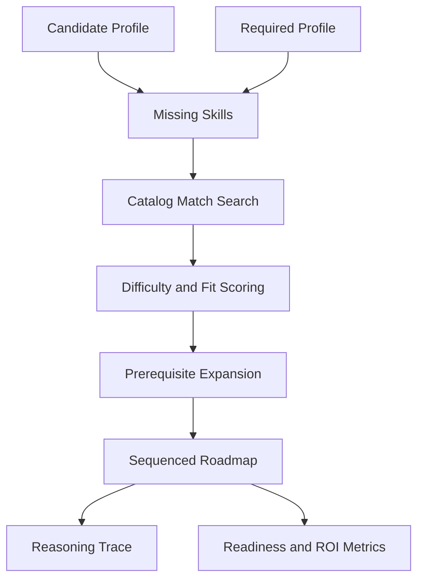

# Hackathon Winning 5-Slide PPT Blueprint

This document is designed to help you build a **judge-facing, polished, high-conviction PPT** while still respecting the hackathon rule that the presentation must be **strictly limited to 5 slides**.

Use this file as your slide-writing master copy.

## Presentation Strategy

Your PPT should do three things at once:

1. prove that the product solves a real onboarding pain point
2. prove that the system is technically grounded and original
3. prove that your team can communicate clearly and professionally

## Deck Style Direction

Keep the slide design aligned with the product:

- dark premium background
- blue-cyan accent highlights
- minimal text blocks
- strong numbers in large type
- 1 visual anchor per slide
- consistent spacing and hierarchy

Recommended visual language:

- title size: very large and bold
- body text: short and sharp, never paragraph-heavy on the slide
- screenshots: clean, cropped, high contrast
- diagrams: simple, readable, color-coded

Recommended deck timing:

- Slide 1: `25-30 sec`
- Slide 2: `30-35 sec`
- Slide 3: `25-30 sec`
- Slide 4: `35-40 sec`
- Slide 5: `30-35 sec`

Total target:

- `2.5 to 3 minutes`

---

## Slide 1 - Solution Overview

**Slide title**

CogniSync AI: Adaptive Onboarding Engine

**Slide objective**

Make the judges care immediately. Establish the business pain, your product promise, and why this is more than a resume parser.

**Best slide structure**

- left side: problem and solution
- right side: product screenshot or polished hero mockup

**On-slide copy**

**Problem**

- corporate onboarding is still static and one-size-fits-all
- experienced hires waste time on content they already know
- junior hires are pushed into advanced modules too early

**Our solution**

- CogniSync AI compares a candidate's current skills with the target role
- detects the real skill gap
- generates a grounded, role-specific onboarding roadmap

**Impact statement**

> Personalized ramp-up, reduced redundant training, faster role readiness.

**What to visually show**

- landing page or upload-to-roadmap screenshot
- 3 small highlight chips:
  - `Skill Gap Detection`
  - `Grounded Learning Path`
  - `Reasoning Trace`

**What to say**

> Most onboarding systems treat every hire the same. We built CogniSync AI to make onboarding adaptive. It reads a resume, compares it against the target job description, identifies the real skill gap, and generates a grounded learning pathway so employees ramp faster without wasting time on irrelevant training.

**Judge takeaway**

- clear problem understanding
- strong product framing
- immediate relevance to the challenge statement

---

## Slide 2 - Architecture & Workflow

**Slide title**

System Architecture & User Workflow

**Slide objective**

Show that the solution is end-to-end complete, not just a UI or a single AI prompt.

**Best slide structure**

- center: one clear workflow diagram
- bottom: 4 short technical callouts

**Main diagram**

**Technical callouts**

- `Upload layer`: PDF, DOCX, TXT support
- `AI layer`: structured resume and JD skill extraction
- `Decision layer`: custom adaptive pathing engine
- `Experience layer`: roadmap, radar, quiz, export

**What to visually show**

- the workflow diagram
- one mini screenshot of the upload screen
- one mini screenshot of the roadmap screen

**What to say**

> Our architecture is a full pipeline. We start with validated document input, extract clean text, use Groq for structured skill analysis, normalize the candidate and role profiles, and then run our own adaptive pathing logic against a grounded course catalog. The output is not just a score. It is an actionable onboarding roadmap with reasoning, metrics, and visual delivery.

**Judge takeaway**

- full-stack completeness
- strong workflow clarity
- practical product maturity

---

## Slide 3 - Tech Stack & Models

**Slide title**

Tech Stack, Models, and Compliance Transparency

**Slide objective**

Signal engineering maturity, model transparency, and honest design choices.

**Best slide structure**

- two-column layout
- left: engineering stack
- right: model + compliance details

**On-slide copy**

**Product stack**

- Next.js 14 + React 18 + TypeScript
- Tailwind CSS + Framer Motion
- Recharts + Three.js for rich visual UX
- `pdf-parse` + `mammoth` for resume extraction
- Dockerized for reproducible evaluation

**AI stack**

- Groq API
- Model: `llama-3.3-70b-versatile`
- structured JSON output for skill extraction
- no embedding model used in current version

**Compliance statement**

- public datasets explicitly cited
- external model usage explicitly disclosed
- adaptive pathing logic is our own implementation

**What to visually show**

- stack logos or a clean stack grid
- one "Transparency" callout badge

**What to say**

> We kept the stack practical and reproducible. The frontend is built in Next.js and TypeScript, the analysis layer uses Groq with Llama 3.3 for structured skill extraction, and the adaptive pathing logic stays local and original. We also disclose our datasets and models clearly, because transparency is part of the judging criteria.

**Judge takeaway**

- strong stack choices
- compliance awareness
- no hidden black-box claims

---

## Slide 4 - Algorithms & Training Logic

**Slide title**

Skill Extraction + Grounded Adaptive Pathing

**Slide objective**

This is the most important technical slide. It must prove originality, grounding, and reasoning quality.

**Best slide structure**

- left: skill extraction logic
- right: adaptive pathing logic
- bottom: one "why this wins" box

**On-slide copy**

**Step 1: Skill extraction**

- derive `candidate_profile` from resume evidence
- derive `required_profile` from JD requirements
- normalize to skill names + inferred proficiency levels
- compute `missing_skills`

**Step 2: Adaptive pathing**

- match each missing skill only against verified catalog modules
- score modules by skill fit and expected proficiency
- auto-expand prerequisites to make the sequence learnable
- compute readiness, coverage, ROI, mentor, and sandbox outputs
- flag unmatched skills instead of hallucinating courses

**Algorithm diagram**

**Why this is strong**

- grounded output
- original recommendation logic
- prerequisite-aware sequencing
- reasoning trace visible to the user

**What to say**

> Our originality is not in training a new foundation model. It is in the decision layer. After extracting structured skills, we compute the actual gap and route that gap through a grounded recommendation engine. Every module must come from a verified catalog, prerequisites are automatically expanded, and anything outside the catalog is flagged rather than hallucinated. That gives us reliability, traceability, and stronger judge trust.

**Judge takeaway**

- originality requirement addressed
- grounding requirement addressed
- reasoning trace requirement addressed

---

## Slide 5 - Datasets & Metrics

**Slide title**

Public Datasets, Internal Metrics, and Validation

**Slide objective**

Prove that your team did not stop at "it works on one example." Show evidence, benchmark thinking, and measurement discipline.

**Best slide structure**

- left: dataset disclosure
- right: benchmark numbers
- bottom: one honest limitation + next-step note

**On-slide copy**

**Public datasets**

- Kaggle Resume Dataset: `snehaanbhawal/resume-dataset`
- Kaggle Job Description Dataset: `kshitizregmi/jobs-and-job-description`
- O*NET release index cited for taxonomy alignment and future expansion

**Current benchmark**

- `2484` resume rows
- `2277` job rows
- `30` executed benchmark cases
- `15` benchmark-ready technical job titles
- `1.0` catalog grounding rate
- `35.87` aligned average readiness
- `27.4` stress average readiness
- `8.47` readiness delta

**Internal metrics tracked**

- role readiness score
- coverage ratio
- unmatched gap rate
- redundant modules bypassed
- estimated hours saved
- estimated budget saved

**Honest limitation**

> The current JD benchmark is strongest for technical roles because the public Kaggle job dataset is heavily tech-skewed.

**What to say**

> We used public datasets not just for citation, but for internal validation. Our current benchmark uses the Kaggle resume and job-description datasets to generate real test cases and run them through the actual adaptive engine. The strongest signal today is in technical roles, where we see full grounding and a clear readiness separation between aligned and stress scenarios.

**Judge takeaway**

- dataset transparency achieved
- internal validation achieved
- communication maturity achieved

---

## Recommended Final Slide Design Notes

To make the PPT feel premium and not generic:

- use large numeric callouts like `1.0`, `8.47`, `2484`, `2277`
- avoid paragraphs on the slide itself
- keep speaker detail in your narration, not in tiny text blocks
- use the real UI screenshots from your app
- use one consistent blue accent instead of many random colors
- keep all icons in one style family

## Screenshot Plan

Take these screenshots from the app for the PPT:

1. landing page hero
2. upload screen
3. roadmap results screen
4. radar chart section
5. reasoning trace section

## Final Speaking Advice

Do not present the product as "AI that magically knows everything."

Present it as:

> a grounded adaptive onboarding system that uses structured AI extraction plus a custom recommendation engine.

That framing is stronger, more believable, and better aligned with the judging rubric.
