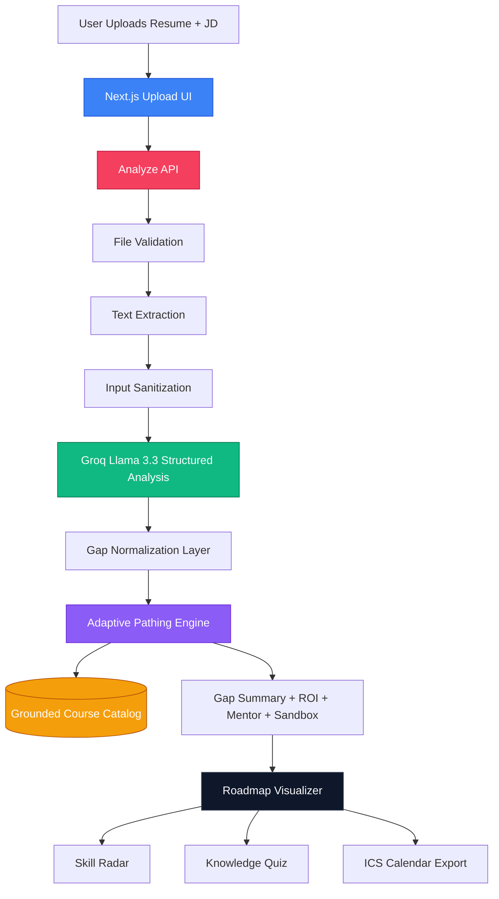
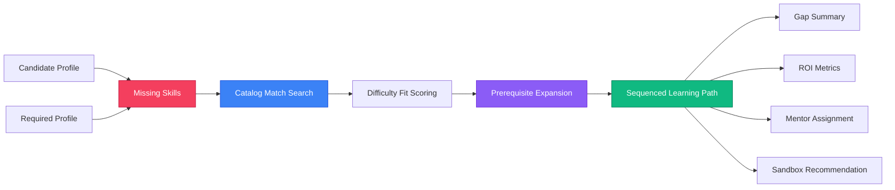
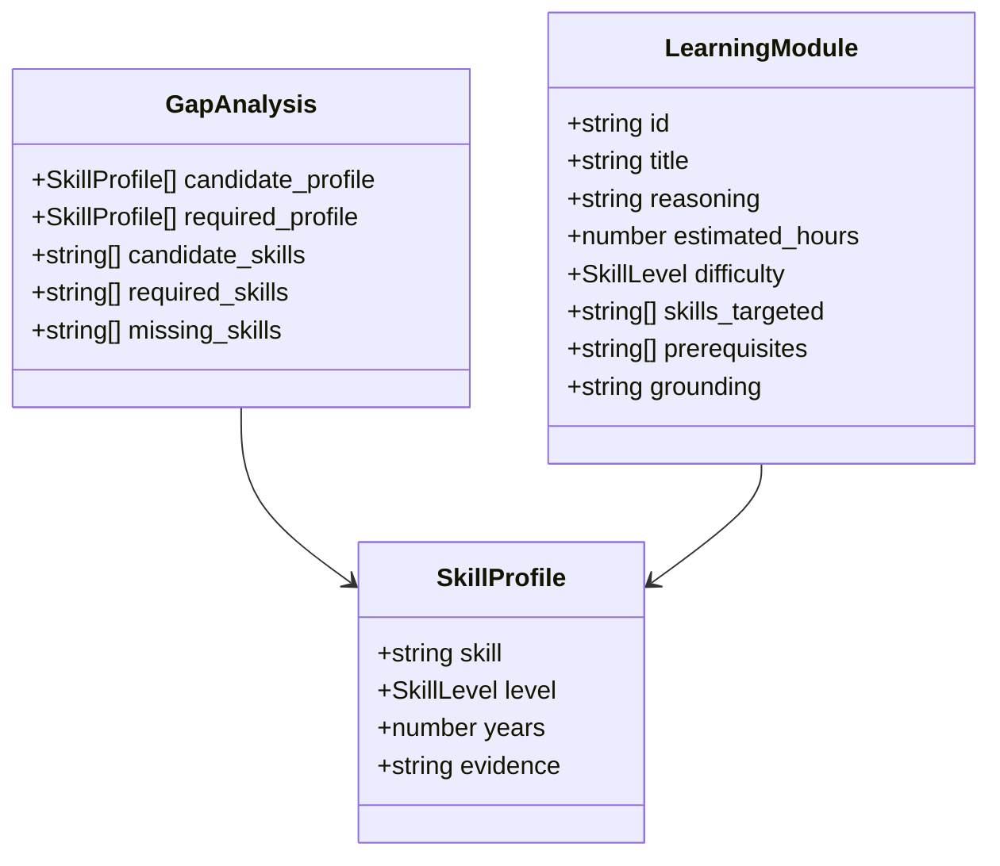
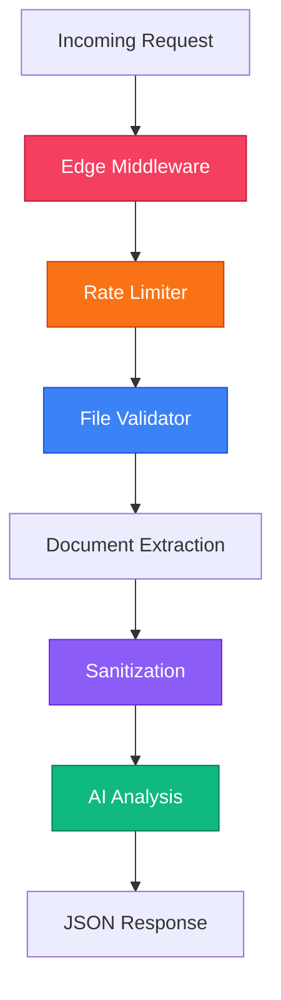

# CogniSync AI - Adaptive Onboarding Engine
**ArtPark CodeForge Hackathon 2026 Submission**

---

## 1. Solution Overview

Corporate onboarding is often static, role-agnostic, and inefficient. Experienced hires are forced through content they already know, while junior hires are expected to absorb advanced modules too early.

**CogniSync AI** solves this by comparing a candidate's resume against a target job description, extracting skill and proficiency signals, identifying the real skill gap, and generating a **grounded, personalized onboarding roadmap** using a verified internal course catalog.

### What makes this strong

| Capability | What it does |
|---|---|
| **Structured Skill Parsing** | Extracts candidate and required skill profiles, including inferred proficiency levels |
| **Grounded Adaptive Pathing** | Maps only verified missing skills to catalog-backed learning modules |
| **Reasoning Trace** | Explains why each module appears in the roadmap |
| **Readiness Metrics** | Calculates role readiness, coverage ratio, hours saved, and budget saved |
| **Interactive UX** | Includes roadmap timeline, skill radar, AI quiz modal, and calendar export |
| **Cross-Domain Coverage** | Supports engineering, analytics, finance, support, sales, and operations pathways |

---

## 2. Architecture & Workflow



### End-to-end flow

1. User uploads a resume file and pastes a job description.
2. The backend validates the file type and size.
3. Resume text is extracted from PDF, DOCX, or TXT.
4. Resume and JD text are sanitized before AI processing.
5. Groq Llama 3.3 returns structured candidate and role skill profiles.
6. The adaptive engine computes missing skills and maps them to grounded catalog modules.
7. The UI visualizes the personalized training pathway with metrics and reasoning.

---

## 3. Tech Stack & Models

| Layer | Technology |
|---|---|
| **Framework** | Next.js 14 App Router |
| **Language** | TypeScript |
| **Styling** | Tailwind CSS |
| **Animations** | Framer Motion |
| **3D UI** | `three`, `@react-three/fiber`, `@react-three/drei` |
| **Charts** | Recharts |
| **AI Model** | Groq API using `llama-3.3-70b-versatile` |
| **Document Parsing** | `pdf-parse`, `mammoth`, native TXT parsing |
| **Security Utilities** | custom middleware, sanitization, rate limiting, file validation |
| **Export** | custom `.ics` calendar generation |
| **Containerization** | Docker |

---

## 4. Algorithms & Training Logic

### Adaptive Pathing Engine

The logic lives in [src/lib/adaptive-logic.ts](/d:/Artpark/src/lib/adaptive-logic.ts).



### What the algorithm now does

- normalizes candidate and required skill profiles
- computes missing skills from the role requirements
- finds exact grounded matches inside the verified course catalog
- scores courses based on skill fit and required proficiency
- auto-includes prerequisites so the pathway is learnable
- calculates coverage ratio and role readiness score
- flags unmatched missing skills instead of hallucinating modules

### Grounding rule

All roadmap modules must come from [src/lib/course-catalog.json](/d:/Artpark/src/lib/course-catalog.json).  
If a missing skill is not present in the catalog, it is surfaced as an **unmatched gap** for manual review instead of generating a fake course.

---

## 5. Data Model

The shared analysis contract lives in [src/lib/analysis-types.ts](/d:/Artpark/src/lib/analysis-types.ts).



This means the app now reasons over:

- candidate skill profile
- required role profile
- missing skills
- grounded modules
- readiness and coverage metrics

---

## 6. Security & Reliability



### Reliability measures

- file size and type validation before parsing
- PDF, DOCX, and TXT support
- sanitized resume and JD text before model calls
- rate limiting on API requests
- structured JSON output normalization from the model
- grounded fallback behavior for unmatched skills

---

## 7. UI & User Experience

| Feature | Description |
|---|---|
| **Cinematic Preloader** | polished branded loading experience |
| **Upload Interface** | drag-and-drop resume upload and JD text input |
| **Roadmap Timeline** | ordered onboarding sequence with hours and reasoning |
| **Skill Radar** | candidate vs role proficiency comparison |
| **Knowledge Quiz** | module-level AI-generated mini assessment |
| **Calendar Export** | download the roadmap as a `.ics` file |
| **Readiness Cards** | role readiness, ROI, mentor, and sandbox summary |

---

## 8. Cross-Domain Scalability

The internal catalog now covers more than only software roles. It includes modules relevant to:

- engineering
- analytics
- finance
- support
- sales
- warehouse and operations
- manufacturing workflows

This directly improves the hackathon's cross-domain scalability criterion.

---

## 9. Project Structure

```text
src/
  app/
    api/
      analyze/route.ts
      quiz/route.ts
    upload/page.tsx
    page.tsx
    layout.tsx
    icon.tsx
    globals.css
  components/
    layout/
      Header.tsx
    ui/
      RoadmapVisualizer.tsx
      SkillRadar.tsx
      KnowledgeQuizModal.tsx
      FileUploadZone.tsx
      DemoAnimation.tsx
      Preloader.tsx
      AICrystal.tsx
      HeroConstellation.tsx
      ParticleGlobe.tsx
      MagneticButton.tsx
  lib/
    analysis-types.ts
    adaptive-logic.ts
    course-catalog.json
    file-validator.ts
    sanitize.ts
    rate-limiter.ts
    ics.ts
  middleware.ts
```

---

## 10. Setup Instructions

### Prerequisites

- Node.js 18+
- a free Groq API key

### Local Development

```bash
git clone <repository-url>
cd Artpark
npm install
cp .env.example .env.local
```

Add your key to `.env.local`:

```bash
GROQ_API_KEY=your_groq_api_key_here
```

Run locally:

```bash
npm run dev
```

Open `http://localhost:3000`

### Docker

```bash
docker build -t cognisync-ai .
docker run -p 3000:3000 -e GROQ_API_KEY=your_groq_api_key_here cognisync-ai
```

---

## 11. Environment Variables

| Variable | Required | Purpose |
|---|---|---|
| `GROQ_API_KEY` | Yes | powers resume/JD analysis and quiz generation |

---

## 12. Datasets & Metrics

### Relevant public references

- O*NET database: https://www.onetcenter.org/db_releases.html
- Resume dataset: https://www.kaggle.com/datasets/snehaanbhawal/resume-dataset/data
- Job description dataset: https://www.kaggle.com/datasets/kshitizregmi/jobs-and-job-description

### Metrics exposed by the engine

- role readiness score
- grounded coverage ratio
- unmatched missing skills
- redundant modules bypassed
- hours saved
- estimated budget saved

---

## 13. Demo Walkthrough

For the 2-3 minute demo:

1. Show the landing page and polished UI.
2. Upload a resume and paste a JD.
3. Show candidate and required profiles with inferred skill levels.
4. Show the roadmap and reasoning trace.
5. Show the radar chart.
6. Open a quiz for one module.
7. Export the onboarding schedule as an `.ics` calendar file.

---

## 14. Teammate Setup

For a detailed beginner-friendly setup walkthrough, see [TEAM_SETUP_GUIDE.md](/d:/Artpark/TEAM_SETUP_GUIDE.md).
