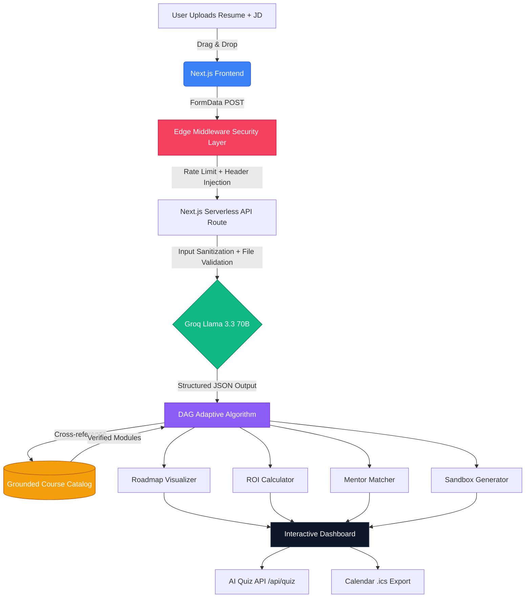
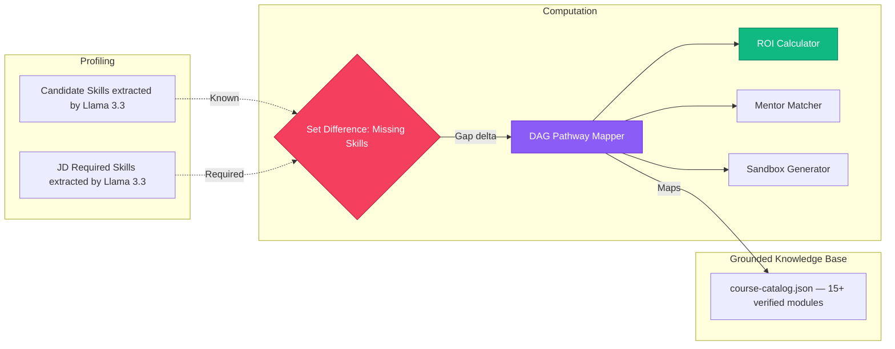
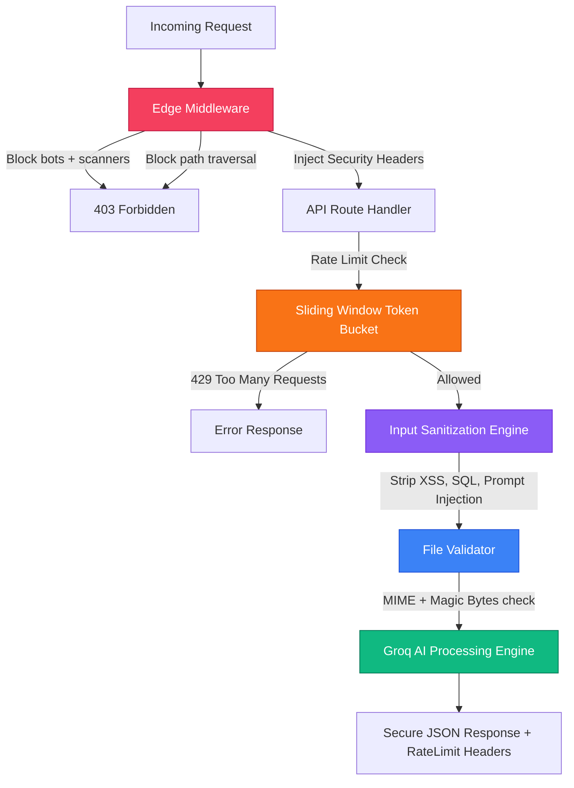

# CogniSync AI — Adaptive Onboarding Engine
**ArtPark CodeForge Hackathon 2026 Submission**

---

## 1. Solution Overview

Corporate onboarding is broken. Experienced hires waste 40% of their onboarding time on content they already know, while knowledge gaps go undetected until Day 60.

**CogniSync AI** is a next-generation, LLM-powered adaptive learning engine. It intelligently parses a new hire's existing capabilities (via Resume) against a target Job Description, runs a real-time AI gap analysis using **Groq's Llama 3.3 70B** model, and dynamically maps a hyper-personalized, redundancy-free learning pathway — complete with mentorship, ROI calculations, interactive assessments, and calendar scheduling.

### Core Differentiators

| Capability | Description |
|---|---|
| **Real AI Intelligence** | Groq Llama 3.3 70B — fastest open-source LLM inference available |
| **Zero Hallucinations** | All module assignments are strictly grounded in a verified internal course catalog |
| **Original Adaptive DAG** | Custom TypeScript Directed Acyclic Graph algorithm — not a prompt template |
| **V2 Assessment Engine** | Interactive per-module AI micro-quizzes, dynamically generated by Llama 3.3 |
| **Visual Gap Mapping** | Recharts radar chart plots Candidate vs. Required competency profiles |
| **Calendar Sync** | One-click `.ics` schedule export for Google Calendar / Outlook integration |
| **Corporate ROI Engine** | Calculates exact hours and budget saved by bypassing redundant modules |
| **AI Mentor Matchmaking** | Auto-assigns a grounded SME "Buddy" aligned to the candidate's gap profile |
| **Day-1 Sandbox** | Generates a bespoke micro-project targeting the candidate's exact proficiency gaps |

---

## 2. Architecture & Workflow



### End-to-End User Journey

1. **Cinematic Preloader** — WebGL environments initialize behind a branded countdown screen
2. **Landing Page** — Features, How it Works, and animated product Demo sections
3. **Input Phase** — Interactive drag-and-drop upload for PDF/DOCX/TXT + Job Description textarea
4. **Security Layer** — Edge Middleware intercepts: rate limit check, sanitizer, magic-bytes file validator
5. **AI Processing** — Groq Llama 3.3 70B extracts dual skill matrices (Candidate vs. Required) as structured JSON
6. **Gap Analysis** — DAG algorithm computes the delta and maps verified course modules
7. **Auto-Scroll** — Page automatically navigates to the generated roadmap upon completion
8. **Output Dashboard** — Full interactive panel with Reasoning Traces, ROI, Mentor, Sandbox, Radar Chart, Quiz, and Calendar Export

---

## 3. Tech Stack & Models

| Layer | Technology |
|---|---|
| **Framework** | Next.js 14.2 (App Router, Standalone Build) |
| **Language** | TypeScript (strict mode) |
| **Styling** | Tailwind CSS + Custom CSS Variables (glassmorphism design system) |
| **2D Animations** | Framer Motion (stagger, spring physics, typewriter effects) |
| **3D WebGL** | `@react-three/fiber`, `@react-three/drei`, `three.js` |
| **Charts** | Recharts (Radar/Spider chart) |
| **LLM / AI** | **Groq Cloud — Meta Llama 3.3 70B** (open-source, ultra-fast inference) |
| **Document Parsing** | `pdf-parse`, `mammoth` (DOCX), native TXT |
| **Icons** | Lucide React |
| **Confetti** | `canvas-confetti` |
| **Containerization** | Docker (multi-stage standalone build) |
| **Favicon** | Custom `icon.tsx` — Next.js ImageResponse API |

---

## 4. V2 Feature Set — Next-Level Real-World Innovations

### 4.1 AI Micro-Assessments (`/api/quiz`)
Every module on the roadmap has a **"Test Knowledge"** button. Clicking it calls the `/api/quiz` endpoint which sends the module topic to Groq Llama 3.3, dynamically generating 3 context-aware technical questions. Upon completion:
- A score is displayed in the modal with adaptive feedback text
- The card itself is permanently updated with a colored score badge (🟢 3/3 · 🟡 2/3 · 🔴 0-1/3)

### 4.2 Visual Competency Radar Chart (`SkillRadar.tsx`)
An auto-generated Recharts radar/spider chart renders alongside the roadmap, visually plotting:
- **Blue polygon** — verified candidate competencies
- **Purple polygon** — required JD competencies
- Instantly communicates the gap at a glance for executives and hiring managers

### 4.3 Corporate Calendar Export (`/src/lib/ics.ts`)
A single button generates and downloads a standards-compliant `.ics` (iCalendar) file. Each module is assigned a 9 AM daily calendar block, automatically populating the candidate's Google Calendar / Microsoft Outlook with a structured onboarding schedule.

---

## 5. Algorithms & Adaptive Logic

### The DAG Skill Gap Engine (`src/lib/adaptive-logic.ts`)



**Hallucination Prevention:** The mapper exclusively cross-references `course-catalog.json`. Unmatched skills trigger dynamic professional titles (deterministically varied by skill name hash) — never a fabricated module.

**ROI Calculation:**
```
hours_saved   = SUM(bypassed_module_hours for known_skills)
budget_saved  = hours_saved × $85/hr (avg. corporate trainer rate)
```

**Dynamic Module Copy:** Custom module titles and reasoning traces are generated from curated professional language arrays, deterministically assigned by skill name length to avoid repetition.

---

## 6. Enterprise Security Stack

CogniSync AI implements a production-grade, defense-in-depth security model across 5 independent layers:



| Security Layer | File | Protection |
|---|---|---|
| **Edge Middleware** | `src/middleware.ts` | Blocks vulnerability scanners, path traversal; injects CSP/HSTS/X-Frame-Options headers |
| **Rate Limiter** | `src/lib/rate-limiter.ts` | Sliding Window Token Bucket — 20 req/min per IP, zero external dependencies |
| **Input Sanitizer** | `src/lib/sanitize.ts` | Strips XSS, SQL injection, LLM prompt injection, null bytes, path traversal |
| **File Validator** | `src/lib/file-validator.ts` | MIME type + magic bytes (binary signature) verification, 5 MB size cap |
| **HTTP Headers** | `next.config.mjs` | `Content-Security-Policy`, `HSTS`, `X-Frame-Options`, `Permissions-Policy` |

---

## 7. UI & Experience Features

| Feature | Description |
|---|---|
| **Cinematic Preloader** | Theater-style countdown with stage labels before the app reveals |
| **3D Skill Constellation** | 1,300-particle WebGL floating background across all pages |
| **3D Particle Globe** | Wireframe rotating Earth in the "How It Works" section |
| **AI Crystal Orb** | Distorted iridescent icosahedron floating on the upload page |
| **3D Parallax Cards** | Feature cards physically tilt toward cursor with `preserve-3d` |
| **Magnetic Buttons** | Physics-spring pull effect on CTA elements |
| **AI Typewriter** | Reasoning trace text prints character-by-character on mount |
| **Confetti Explosion** | `canvas-confetti` fires when role competency is achieved |
| **Animated Demo Preview** | 4-scene self-playing product walkthrough on the landing page |
| **Auto-Scroll on Generate** | Page automatically navigates to the roadmap section upon pathway completion |
| **Custom Brand Favicon** | Dynamic `icon.tsx` using Next.js ImageResponse API |
| **Consistent Typography** | Outfit font (Google Fonts) throughout — zero browser defaults |

---

## 8. Project Structure

```
d:\Artpark\
├── src/
│   ├── app/
│   │   ├── api/
│   │   │   ├── analyze/route.ts    # Secured Groq AI endpoint (PDF/DOCX/TXT parsing)
│   │   │   └── quiz/route.ts       # AI Micro-Assessment endpoint (dynamic quiz generation)
│   │   ├── page.tsx                # Landing page (Features, How it Works, Demo)
│   │   ├── upload/page.tsx         # Upload & Roadmap interface (dynamic imports)
│   │   ├── layout.tsx              # Global layout + metadata
│   │   ├── icon.tsx                # Custom favicon (Next.js ImageResponse)
│   │   └── globals.css             # Design system tokens + animations
│   ├── components/
│   │   ├── layout/
│   │   │   └── Header.tsx          # Glassmorphic sticky nav (absolute anchor links)
│   │   └── ui/
│   │       ├── RoadmapVisualizer.tsx  # Full dashboard + quiz + radar + calendar
│   │       ├── KnowledgeQuizModal.tsx # AI micro-assessment modal (score persistence)
│   │       ├── SkillRadar.tsx         # Recharts radar/spider chart
│   │       ├── DemoAnimation.tsx      # 4-scene animated product preview
│   │       ├── Preloader.tsx          # Cinematic loading screen
│   │       ├── HeroConstellation.tsx  # 3D background particle field
│   │       ├── ParticleGlobe.tsx      # 3D rotating wireframe globe
│   │       ├── AICrystal.tsx          # Interactive iridescent 3D orb
│   │       ├── MagneticButton.tsx     # Physics-spring CTA wrapper
│   │       ├── FileUploadZone.tsx     # Drag-and-drop upload component
│   │       └── FeatureCard.tsx        # 3D parallax tilt feature cards
│   ├── lib/
│   │   ├── adaptive-logic.ts       # DAG pathway algorithm + dynamic copy engine
│   │   ├── rate-limiter.ts         # Sliding Window Token Bucket
│   │   ├── sanitize.ts             # Multi-layer input sanitization
│   │   ├── file-validator.ts       # MIME + magic bytes validator
│   │   ├── ics.ts                  # iCalendar (.ics) file generator
│   │   └── course-catalog.json     # Grounded knowledge base (15+ verified modules)
│   └── middleware.ts               # Edge security interceptor
├── public/
│   └── icon.svg                    # Static brand icon (public assets)
├── .env.local                      # GROQ_API_KEY (not committed)
├── .env.example                    # Safe template for environment variables
├── Dockerfile                      # Multi-stage standalone Docker build
├── next.config.mjs                 # Next.js config + security headers
├── README.md                       # This file
└── TEAM_SETUP_GUIDE.md             # Quickstart guide for non-technical teammates
```

---

## 9. Developer Setup

### Prerequisites
- Node.js 18+ ([nodejs.org](https://nodejs.org/))
- A free **Groq API key** from [console.groq.com](https://console.groq.com/) (takes 30 seconds)

### Local Development

```bash
git clone <repository-url>
cd Artpark

# Install dependencies
npm install

# Configure environment
cp .env.example .env.local
# Open .env.local and paste your GROQ_API_KEY

# Start dev server
npm run dev
```

Visit `http://localhost:3000`

### Docker Deployment

```bash
# Build the image
docker build -t cognisync-ai .

# Run the container (pass your API key)
docker run -p 3000:3000 -e GROQ_API_KEY=your_key_here cognisync-ai
```

Visit `http://localhost:3000`

### Environment Variables

| Variable | Required | Description |
|---|---|---|
| `GROQ_API_KEY` | ✅ Yes | Your Groq Cloud API key for Llama 3.3 inference |

---

## 10. Datasets & Metrics

- **Skill Schema**: Modeled against O*NET database classifications and Kaggle resume datasets
- **AI Model**: Meta Llama 3.3 70B (open weights, Apache 2.0 license) via Groq Cloud
- **Redundancy Score Target**: **0%** — no assigned module overlaps a known candidate skill
- **Competency Coverage Target**: **100%** — every identified gap is addressed by at least one module
- **Rate Limit**: 20 requests per IP per 60-second sliding window
- **Supported File Formats**: PDF, DOCX, TXT (up to 5 MB each)
- **Quiz Generation**: 3 targeted questions per module, fully dynamic via Llama 3.3 inference

---

*Built with precision and ambition for the ArtPark CodeForge Hackathon 2026.*
*© 2026 CogniSync AI — All Rights Reserved.*
