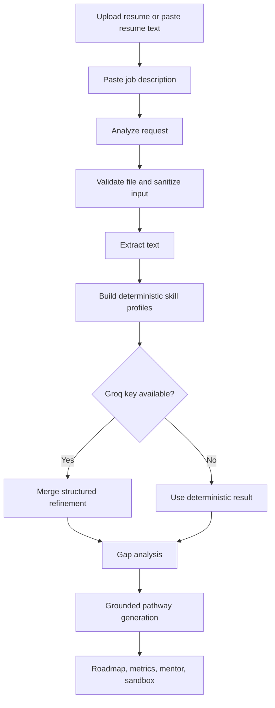

# CogniSync AI

CogniSync AI is an adaptive onboarding application built with Next.js and TypeScript. It reads a resume and a target job description, compares the current profile against the target role, and produces a grounded learning pathway based on a fixed internal course catalog.

The project is designed to keep recommendations explainable:

- skill extraction is deterministic by default
- Groq-based structured extraction is optional
- under-leveled skills are treated as gaps, not just missing skills
- every learning step is mapped to the local course catalog
- unmatched skills are surfaced for manual review instead of fabricated

## Features

- resume upload for PDF, DOCX, and TXT files
- pasted resume text and job description support
- role-aware gap analysis with evidence and inferred levels
- staged learning pathway with reasoning traces
- readiness and ROI summaries
- radar chart, quiz modal, and calendar export
- sample scenarios for quick walkthroughs

## Tech Stack

| Layer | Choice |
|---|---|
| App framework | Next.js 14 App Router |
| Language | TypeScript |
| Styling | Tailwind CSS |
| Motion | Framer Motion |
| 3D visuals | `three`, `@react-three/fiber`, `@react-three/drei` |
| Charts | Recharts |
| Resume parsing | `pdf-parse`, `mammoth`, native TXT handling |
| Optional LLM integration | Groq API |
| Core adaptation logic | Local TypeScript engine |
| Containerization | Docker |

## How It Works



## Adaptive Logic

The core logic lives in [`src/lib/analysis-engine.ts`](src/lib/analysis-engine.ts) and [`src/lib/adaptive-logic.ts`](src/lib/adaptive-logic.ts).

The engine:

1. normalizes candidate and role skill profiles
2. infers relative proficiency from context
3. identifies missing and under-proficient skills
4. maps gaps to catalog-backed learning modules
5. resolves prerequisites before sequencing
6. groups the final output into Foundation, Core, and Applied stages

## Project Structure

```text
src/
  app/
    api/
      analyze/route.ts
      quiz/route.ts
    layout.tsx
    page.tsx
    upload/page.tsx
  components/
    layout/
      Header.tsx
    ui/
      AICrystal.tsx
      DemoAnimation.tsx
      FileUploadZone.tsx
      KnowledgeQuizModal.tsx
      Preloader.tsx
      RoadmapVisualizer.tsx
      SkillRadar.tsx
  lib/
    adaptive-logic.ts
    analysis-engine.ts
    analysis-types.ts
    course-catalog.json
    demo-scenarios.ts
    file-validator.ts
    ics.ts
    rate-limiter.ts
    sanitize.ts
    skill-taxonomy.ts
scripts/
  clean-next.js
  verify-engine.mjs
Dockerfile
TEAM_SETUP_GUIDE.md
```

## Local Setup

### Prerequisites

- Node.js 18 or newer
- npm
- optional: a Groq API key

### Install

```bash
git clone <your-repository-url>
cd ArtPark_team_monikabhati2005
npm install
```

### Environment

Create `.env.local` from `.env.example`.

```bash
cp .env.example .env.local
```

Example:

```bash
GROQ_API_KEY=your_groq_api_key_here
GROQ_MODEL=llama-3.3-70b-versatile
```

Notes:

- `GROQ_API_KEY` is optional
- if no key is provided, the app stays in deterministic mode
- `GROQ_MODEL` is optional unless you want to override the default

### Run

```bash
npm run dev
```

Open `http://localhost:3000`.

## Quality Checks

Run these before sharing or deploying:

```bash
npm run lint
npm run build
npm run verify:logic
```

What they do:

- `npm run lint` checks code quality and static issues
- `npm run build` verifies the production build
- `npm run verify:logic` runs scenario checks against the adaptive engine

## Docker

```bash
docker build -t cognisync-ai .
docker run -p 3000:3000 -e GROQ_API_KEY=your_groq_api_key_here cognisync-ai
```

## API Overview

### `POST /api/analyze`

Accepts:

- `resume` as PDF, DOCX, or TXT
- or `resumeText`
- `jd`

Returns:

- candidate and required profiles
- missing skills and gap details
- staged pathway output
- readiness and ROI metrics
- mentor and sandbox recommendations
- analysis metadata

### `POST /api/quiz`

Accepts:

- `skill`

Returns:

- three multiple-choice questions for a quick skill check

## Notes

- the course catalog is local and fixed for grounding
- unmatched requirements are intentionally surfaced instead of auto-filled
- sample scenarios are available in [`src/lib/demo-scenarios.ts`](src/lib/demo-scenarios.ts)
- a non-technical setup walkthrough is available in [`TEAM_SETUP_GUIDE.md`](TEAM_SETUP_GUIDE.md)
