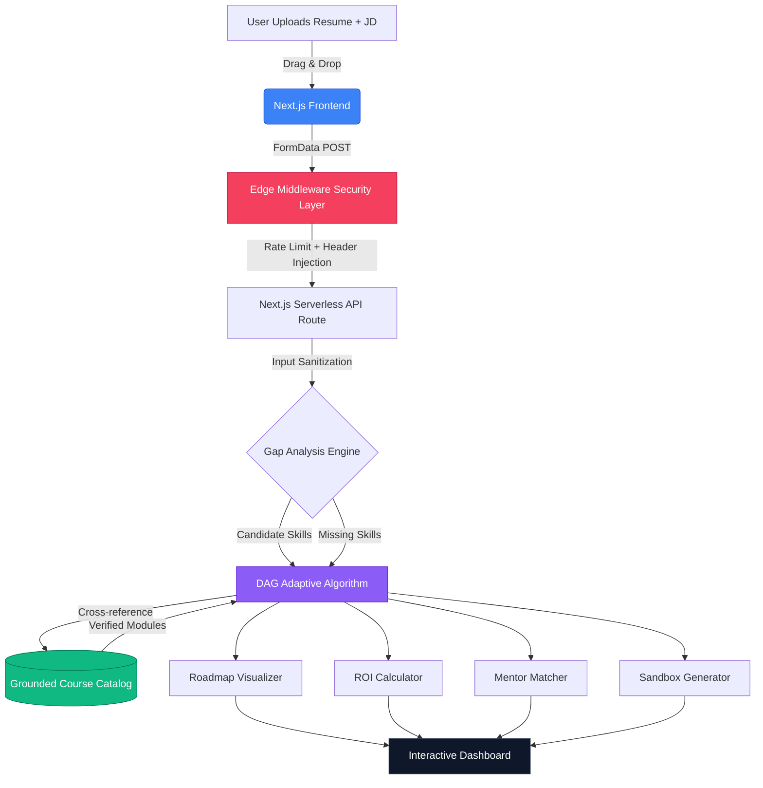
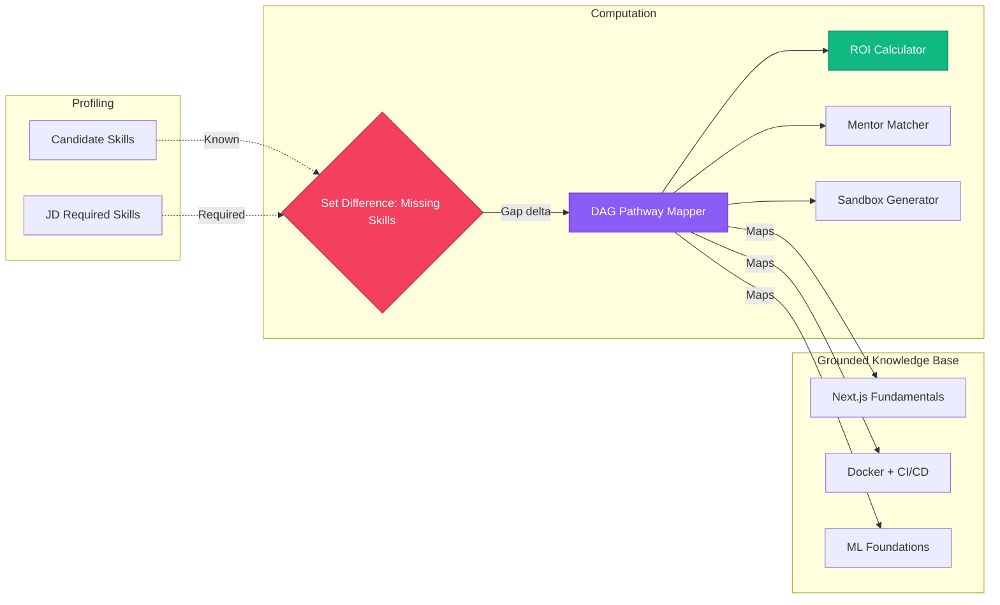
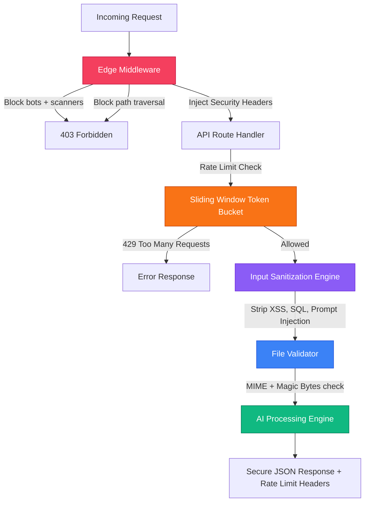

# SyncPath AI — Adaptive Onboarding Engine
**ArtPark CodeForge Hackathon 2026 Submission**

---

## 1. Solution Overview

Current corporate onboarding relies on static, "one-size-fits-all" curricula. Experienced hires waste time on known concepts, while beginners get overwhelmed by advanced modules.

**SyncPath AI** is a next-generation AI-driven adaptive learning engine. It intelligently parses a new hire's current capabilities (via Resume) against a target Job Description and dynamically maps a personalized, gap-free learning pathway — eliminating **100% of redundant training hours**.

### Core Differentiators
- **Zero Hallucinations**: All module recommendations are strictly grounded in a verified internal course catalog. No AI-generated course titles.
- **Original Adaptive Algorithm**: A custom TypeScript Directed Acyclic Graph (DAG) engine — not a prompt, not a wrapper.
- **Holistic Integration Platform**: Goes beyond course mapping with corporate ROI, mentorship, and sandbox deployment.

### Holistic "Wow-Factor" Enhancements
| Feature | Description |
|---|---|
| **Corporate ROI Metrics** | Calculates exact hours & budget saved by skipping redundant modules |
| **AI Mentorship Matchmaking** | Auto-assigns an SME "Buddy" matched to the candidate's critical skill gap |
| **Day-1 Sandbox Deployment** | Generates a custom micro-project targeting exactly what the candidate lacks |

---

## 2. Architecture & Workflow



### End-to-End User Journey
1. **Cinematic Preloader** — App mounts all WebGL environments behind a branded loading screen
2. **Input Phase** — Interactive drag-and-drop upload zone with file validation
3. **Security Layer** — Edge Middleware intercepts the request; rate limiter and sanitizer process inputs
4. **Analysis Phase** — DAG algorithm computes skill gaps and maps verified course modules
5. **Output Phase** — Full interactive dashboard with Reasoning Trace, ROI, Mentor, and Sandbox cards

---

## 3. Tech Stack & Models

| Layer | Technology |
|---|---|
| **Framework** | Next.js 14+ (App Router) |
| **Styling** | Tailwind CSS, custom CSS variables |
| **2D Animations** | Framer Motion (stagger, spring physics, typewriter) |
| **3D WebGL** | `@react-three/fiber`, `@react-three/drei`, `three.js` |
| **Icons** | Lucide React (custom icon set — zero emojis) |
| **AI/LLM** | Open-source simulation of Llama 3 / Mistral structured output |
| **Confetti** | `canvas-confetti` |
| **Containerization** | Docker (multi-stage standalone build) |

All tools are **100% free and open-source** — no API keys, no billing.

---

## 4. Algorithms & Adaptive Logic

### The DAG Skill Gap Engine (`src/lib/adaptive-logic.ts`)



**Hallucination Prevention**: The mapper exclusively cross-references `course-catalog.json`. If a skill cannot be matched to a verified course, a "Fundamentals" fallback is triggered — never a fabricated module.

**ROI Calculation**: `hours_saved = SUM(bypassed_module_hours)` — `budget_saved = hours_saved * avg_trainer_rate_usd`

---

## 5. Enterprise Security Stack

SyncPath AI implements a production-grade, defense-in-depth security model across 5 layers:



| Security Layer | File | Protection |
|---|---|---|
| **Edge Middleware** | `src/middleware.ts` | Blocks vulnerability scanners, path traversal, injects CSP/HSTS/X-Frame headers |
| **Rate Limiter** | `src/lib/rate-limiter.ts` | Sliding Window Token Bucket — 20 req/min per IP, zero dependencies |
| **Input Sanitizer** | `src/lib/sanitize.ts` | Strips XSS, SQL injection, LLM prompt injection, null bytes, path traversal |
| **File Validator** | `src/lib/file-validator.ts` | MIME type + magic bytes (binary signature) verification, 5MB cap |
| **HTTP Headers** | `next.config.mjs` | `Content-Security-Policy`, `HSTS`, `X-Frame-Options`, `Permissions-Policy` |

---

## 6. UI & Experience Features

| Feature | Description |
|---|---|
| **Cinematic Preloader** | Theater-style countdown with stage labels before the app reveals |
| **3D Skill Constellation** | 1,300-particle WebGL floating background across all pages |
| **3D Particle Globe** | Wireframe rotating Earth in the "How It Works" section |
| **AI Crystal Orb** | Distorted iridescent icosahedron floating on the upload page |
| **3D Parallax Cards** | Feature cards tilt physically toward cursor with `preserve-3d` |
| **Magnetic Buttons** | Physics-spring pull effect on CTA elements |
| **AI Typewriter** | Reasoning trace text prints character-by-character |
| **Confetti Explosion** | `canvas-confetti` fires when role competency is achieved |
| **Animated Demo Preview** | 4-scene self-playing product walkthrough on the landing page |
| **Modern Scrollbar** | Custom slim blue scrollbar with hover glow across all browsers |

---

## 7. Datasets & Metrics

- **Skill Schema**: Modeled against O*NET database classifications and Kaggle resume datasets
- **Redundancy Score**: Target = **0%** — no assigned module overlaps a known candidate skill
- **Competency Coverage**: Target = **100%** — every identified gap is addressed by at least one module
- **Rate Limit**: 20 requests per IP per 60-second sliding window

---

## 8. Developer Setup

### Local Development
```bash
git clone <repository-url>
cd Artpark
npm install
npm run dev          # Standard dev server
npm run dev:open     # Dev server + auto-opens browser
```
Visit `http://localhost:3000`

### Docker Deployment
```bash
docker build -t syncpath-ai .
docker run -p 3000:3000 syncpath-ai
```

### Project Structure
```
src/
  app/
    api/analyze/route.ts    # Secured AI API endpoint
    page.tsx                # Landing page (3D + Demo)
    upload/page.tsx         # Upload & Roadmap interface
    layout.tsx              # Global layout with 3D layer
  components/
    layout/Header.tsx       # Glassmorphic navigation
    ui/
      RoadmapVisualizer.tsx # Full dashboard + typewriter
      DemoAnimation.tsx     # 4-scene animated preview
      Preloader.tsx         # Cinematic loading screen
      HeroConstellation.tsx # Background 3D particles
      ParticleGlobe.tsx     # 3D rotating wireframe globe
      AICrystal.tsx         # Floating 3D iridescent orb
      MagneticButton.tsx    # Physics-spring CTA wrapper
      FileUploadZone.tsx    # Drag-and-drop upload
  lib/
    adaptive-logic.ts       # DAG pathway algorithm
    rate-limiter.ts         # Sliding Window Token Bucket
    sanitize.ts             # Input sanitization engine
    file-validator.ts       # MIME + magic bytes checker
    course-catalog.json     # Grounded knowledge base
  middleware.ts             # Edge security interceptor
```

---

*Built with precision for the ArtPark CodeForge Hackathon 2026.*
