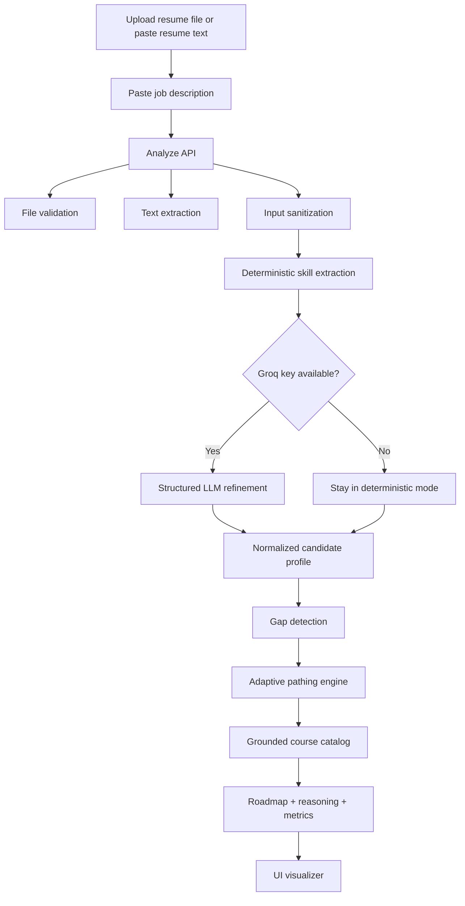
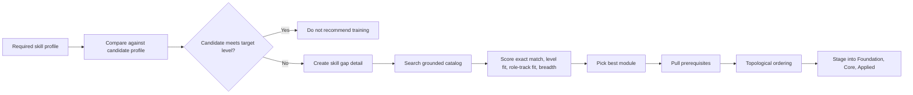

# CogniSync AI

CogniSync AI is an adaptive onboarding engine built for the ArtPark CodeForge Hackathon. It reads a candidate's current capability from a resume, compares that against a target job description, identifies real skill gaps, and generates a grounded training roadmap using a fixed internal course catalog.

The product is designed to score well on the actual judging criteria:

- intelligent parsing of resume plus JD
- dynamic skill-gap mapping
- grounded recommendations with no invented courses
- reasoning traces for every recommendation
- polished web UI with demo-ready interaction
- cross-domain coverage beyond only software roles

## Why This Submission Is Strong

Most hackathon solutions stop at "extract some skills and call an LLM." This project goes further:

- it uses a hybrid parser: deterministic extraction first, optional Groq refinement second
- it treats under-proficiency as a gap, not only total absence
- it keeps recommendation grounding strict by mapping only to a local course catalog
- it supports engineering, analytics, support, operations, sales, and finance flows
- it includes a verification script for scenario-based edge-case checks
- it ships with a teammate guide, Docker support, and a polished README for judges

## Finalized Tech Stack

| Layer | Choice | Why it fits the hackathon |
|---|---|---|
| App framework | Next.js 14 App Router | Fast full-stack prototype, clean API routes, judge-friendly demo deployment |
| Language | TypeScript | Safer contracts across UI, parser, and pathing engine |
| Styling | Tailwind CSS | Fast iteration while keeping a strong visual system |
| Motion | Framer Motion | Smooth, demo-friendly animations without heavy custom animation code |
| Visual layer | `three`, `@react-three/fiber`, `@react-three/drei` | Adds depth to the landing page without affecting the core onboarding workflow |
| Charts | Recharts | Clean radar chart for candidate vs required skills |
| Resume parsing | `pdf-parse`, `mammoth`, native TXT | Open-source parsing for common resume formats |
| AI extraction | Groq API with `llama-3.3-70b-versatile` | Fast structured extraction when a free API key is available |
| Core adaptation | Custom TypeScript engine | Original logic for gap detection, sequencing, staging, and grounding |
| Verification | Custom Node script | Quick scenario-based checks for demo and edge-case confidence |
| Containerization | Docker multi-stage build | Reproducible judge environment |

## Open-Source + Free Resource Policy

This implementation avoids paid infrastructure requirements:

- Groq is optional and used only when you add a free API key
- without a Groq key, the app still works in deterministic local mode
- all parsing libraries in the project are open source
- the course catalog and adaptive logic are implemented inside this repository

## Challenge Requirement Coverage

| Hackathon requirement | How CogniSync AI satisfies it |
|---|---|
| Intelligent Parsing | Resume and JD are converted into structured skill profiles with levels, evidence, and role-track inference |
| Dynamic Mapping | Missing or under-leveled skills are mapped to grounded catalog modules with prerequisites |
| Functional Interface | Next.js web UI supports resume upload, pasted text, demo presets, roadmap visualization, and quiz checks |
| Reasoning Trace | Every learning step explains why it appears in the plan |
| Grounding and Reliability | Unmatched skills are explicitly flagged for manual review instead of hallucinated |

## Product Flow



## System Architecture

```mermaid
graph TD
    UI[Next.js UI] --> ANALYZE[/api/analyze]
    UI --> QUIZ[/api/quiz]
    ANALYZE --> VALIDATOR[File validator]
    ANALYZE --> EXTRACTOR[PDF DOCX TXT extractor]
    ANALYZE --> SANITIZER[Sanitizer]
    ANALYZE --> HEURISTIC[Deterministic parser]
    ANALYZE --> GROQ[Groq structured extraction]
    HEURISTIC --> MERGE[Hybrid analysis merge]
    GROQ --> MERGE
    MERGE --> GAP[Gap engine]
    GAP --> PATH[Adaptive pathing]
    PATH --> CATALOG[Grounded course catalog]
    PATH --> ROI[Readiness and ROI metrics]
    PATH --> STAGES[Foundation Core Applied stages]
    QUIZ --> GROQ
    QUIZ --> FALLBACK[Fallback quiz generator]
```

## Adaptive Pathing Logic



## Original Adaptive Logic

The engine lives in `src/lib/adaptive-logic.ts` and `src/lib/analysis-engine.ts`.

Core ideas:

1. Parse both documents into normalized skill profiles.
2. Infer proficiency, not just skill presence.
3. Mark a gap when the candidate level is below the target level.
4. Score grounded catalog modules by:
   - exact skill match
   - difficulty fit
   - role-track alignment
   - additional gap coverage
   - prerequisite overhead
5. Pull dependencies automatically.
6. Sequence the final plan in dependency-safe order.
7. Surface unmatched skills for manual review instead of inventing content.

## Judging Alignment

| Evaluation area | What the judges can see in the product |
|---|---|
| Technical sophistication | Hybrid parsing, level-aware gap detection, staged sequencing, role-aware module scoring |
| Grounding and reliability | Recommendations come only from `src/lib/course-catalog.json` |
| Reasoning trace | Every module card includes a plain-language explanation |
| Product impact | Readiness score, hours saved, budget saved, redundant modules bypassed |
| User experience | Upload flow, demo presets, timeline cards, radar chart, quiz modal, calendar export |
| Cross-domain scalability | Catalog and taxonomy cover engineering, analytics, operations, support, sales, finance |
| Communication and documentation | README, Dockerfile, teammate guide, and verification script |

## UI Features

- landing page with animated hero and clear problem framing
- upload flow with resume file upload and optional pasted resume text
- demo presets for faster judge walkthroughs
- candidate profile vs role requirements view
- role readiness, total hours, ROI, and mentor summary cards
- staged pathway output
- skill radar chart
- per-skill micro-quiz modal
- `.ics` calendar export

## Repository Structure

```text
src/
  app/
    api/
      analyze/route.ts
      quiz/route.ts
    upload/page.tsx
    page.tsx
    layout.tsx
    globals.css
  components/
    layout/
      Header.tsx
    ui/
      FileUploadZone.tsx
      KnowledgeQuizModal.tsx
      RoadmapVisualizer.tsx
      SkillRadar.tsx
      DemoAnimation.tsx
      Preloader.tsx
  lib/
    adaptive-logic.ts
    analysis-engine.ts
    analysis-types.ts
    course-catalog.json
    demo-scenarios.ts
    file-validator.ts
    skill-taxonomy.ts
    sanitize.ts
    rate-limiter.ts
    ics.ts
scripts/
  clean-next.js
  verify-engine.mjs
TEAM_SETUP_GUIDE.md
Dockerfile
```

## Local Setup

### Prerequisites

- Node.js 18 or newer
- npm
- optional: a free Groq API key

### Install

```bash
git clone <your-repository-url>
cd Artpark
npm install
```

### Environment

Create `.env.local` from `.env.example`.

```bash
cp .env.example .env.local
```

Add your values:

```bash
GROQ_API_KEY=your_groq_api_key_here
GROQ_MODEL=llama-3.3-70b-versatile
```

Notes:

- `GROQ_API_KEY` is optional
- if the key is missing, the app still runs in deterministic parsing mode
- `GROQ_MODEL` is optional and can be omitted

### Run the App

```bash
npm run dev
```

Open:

```text
http://localhost:3000
```

## Quality Checks

Run all three before submission:

```bash
npm run lint
npm run build
npm run verify:logic
```

What they do:

- `npm run lint` checks code quality
- `npm run build` verifies production compilation
- `npm run verify:logic` runs scenario checks against the adaptive engine

## Docker

```bash
docker build -t cognisync-ai .
docker run -p 3000:3000 -e GROQ_API_KEY=your_groq_api_key_here cognisync-ai
```

## API Contract

### `POST /api/analyze`

Accepts:

- `resume` file upload in PDF, DOCX, or TXT
- or `resumeText`
- `jd`

Returns:

- normalized candidate profile
- normalized required profile
- missing skill list
- skill gap details
- staged pathway
- readiness and ROI metrics
- sandbox and mentor recommendations
- analysis metadata

### `POST /api/quiz`

Accepts:

- `skill`

Returns:

- 3 multiple-choice questions for quick validation

## Open Datasets and References

Recommended public references aligned with this problem statement:

- O*NET database: https://www.onetcenter.org/db_releases.html
- Resume dataset: https://www.kaggle.com/datasets/snehaanbhawal/resume-dataset/data
- Jobs and job descriptions dataset: https://www.kaggle.com/datasets/kshitizregmi/jobs-and-job-description
- Groq API docs: https://console.groq.com/docs/api-reference

The current implementation uses a curated local catalog for strict grounding, but the parsing and taxonomy layers are designed so these public datasets can be integrated later.

## Demo Strategy For The 2-3 Minute Video

Use this flow:

1. Open the landing page and state the problem: static onboarding wastes time.
2. Move to the upload screen.
3. Load one demo preset first to show instant adaptation.
4. Show the candidate profile, required profile, and skill gap matrix.
5. Walk through the Foundation, Core, and Applied stages.
6. Highlight reasoning traces and the "no hallucinated modules" rule.
7. Show the radar chart, quiz modal, and calendar export.
8. End with readiness score and hours saved.

## 5-Slide Deck Blueprint

### Slide 1: Solution Overview

- problem: static onboarding wastes time and misses role-specific gaps
- solution: adaptive onboarding engine with grounded path generation
- value: faster ramp-up, less redundancy, clearer competency progression

### Slide 2: Architecture and Workflow

- show the system architecture diagram from this README
- explain hybrid parsing, gap engine, and grounded catalog mapping

### Slide 3: Tech Stack and Models

- Next.js, TypeScript, Tailwind, Framer Motion
- Groq plus Llama 3.3 for optional structured extraction
- open-source parsing libraries and internal adaptive engine

### Slide 4: Algorithms and Training Logic

- proficiency-aware gap detection
- course scoring
- prerequisite resolution
- stage generation
- reasoning trace generation

### Slide 5: Datasets and Metrics

- cite O*NET and Kaggle datasets
- show readiness score, coverage ratio, hours saved, budget saved, unmatched skills count

## Teammate Guide

For a non-technical setup walkthrough, read `TEAM_SETUP_GUIDE.md`.
