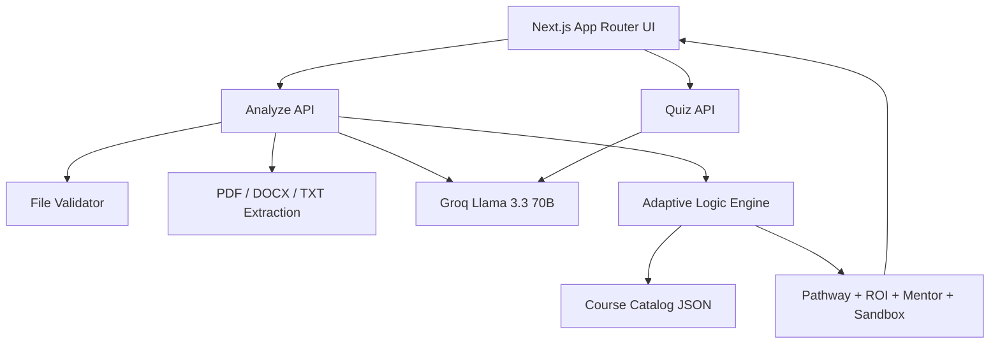

# CogniSync AI

Adaptive onboarding engine built for the ArtPark CodeForge Hackathon 2026.

CogniSync AI compares a candidate's resume against a target job description, extracts skill and experience signals, identifies grounded skill gaps, and generates a personalized onboarding pathway using a verified course catalog. The product includes a polished web UI, reasoning traces, skill radar, AI micro-quizzes, and calendar export.

## Problem We Solve

Traditional onboarding is static. Strong hires waste time on concepts they already know, while newer hires get pushed into content without enough scaffolding. CogniSync AI fixes that by:

- parsing current skills from a resume
- parsing required skills and target proficiency from a job description
- calculating the gap between the two
- mapping only the missing skills to grounded training modules
- sequencing those modules with prerequisite awareness

## Challenge Coverage

This repository implements the core hackathon requirements:

- Intelligent parsing: resume and JD are analyzed into candidate and required skill profiles with inferred proficiency levels.
- Dynamic mapping: missing skills are mapped to a verified catalog with prerequisite-aware sequencing.
- Functional interface: users can upload a resume, paste a JD, and view a personalized roadmap.
- Reasoning trace: every recommended module carries an explicit why-this-step explanation.
- Grounding: unmatched gaps are flagged for manual review instead of being turned into fabricated courses.

## Solution Workflow

```mermaid
flowchart TD
    A[Upload Resume + JD] --> B[Next.js Upload UI]
    B --> C[/api/analyze]
    C --> D[File Validation]
    D --> E[Text Extraction]
    E --> F[Sanitization]
    F --> G[Groq Llama 3.3 Structured Analysis]
    G --> H[Gap Analysis Normalization]
    H --> I[Adaptive Pathing Engine]
    I --> J[Grounded Course Catalog]
    I --> K[Roadmap Visualizer]
    K --> L[Skill Radar]
    K --> M[Knowledge Quiz]
    K --> N[ICS Calendar Export]
```

## Architecture



## Tech Stack

| Layer | Technology |
|---|---|
| Framework | Next.js 14 App Router |
| Language | TypeScript |
| Styling | Tailwind CSS |
| Animation | Framer Motion |
| 3D Visuals | `three`, `@react-three/fiber`, `@react-three/drei` |
| Charts | Recharts |
| LLM | Groq API with `llama-3.3-70b-versatile` |
| Document Parsing | `pdf-parse`, `mammoth`, native TXT |
| Security Utilities | custom middleware, sanitization, rate limiting, file validation |
| Export | custom `.ics` generator |
| Containerization | Docker multi-stage build |

## Skill-Gap Logic

The adaptive logic lives in [src/lib/adaptive-logic.ts](/d:/Artpark/src/lib/adaptive-logic.ts).

High-level behavior:

1. Normalize candidate and required skill profiles.
2. Compute missing skills as the set difference between required and candidate competencies.
3. Search the internal course catalog for exact grounded matches to each missing skill.
4. Pick the best course based on skill match and target difficulty.
5. Pull in prerequisite modules automatically so the sequence is learnable.
6. Calculate coverage, readiness score, bypassed hours, and budget savings.
7. If a missing skill is not represented in the catalog, flag it for manual review instead of inventing a fake module.

## Data Model

The shared analysis contract lives in [src/lib/analysis-types.ts](/d:/Artpark/src/lib/analysis-types.ts).

```ts
type SkillLevel = 'beginner' | 'intermediate' | 'advanced'

interface SkillProfile {
  skill: string
  level: SkillLevel
  years?: number
  evidence?: string
}
```

The analyze API returns:

- `candidate_profile`
- `required_profile`
- `candidate_skills`
- `required_skills`
- `missing_skills`
- `pathway`
- `gap_summary`
- `roi_metrics`
- `mentorship_match`
- `sandbox_project`

## Grounding Policy

CogniSync AI is intentionally grounded.

- Pathway modules come only from [src/lib/course-catalog.json](/d:/Artpark/src/lib/course-catalog.json).
- The engine does not fabricate missing courses.
- If a detected skill gap is not covered by the catalog, it is surfaced as `unmatched_missing_skills` for mentor-led review.

This directly supports the hackathon's grounding and reliability criterion.

## Supported Role Breadth

The catalog includes modules spanning multiple domains, not only software engineering:

- engineering
- analytics
- finance
- support
- sales
- operations
- warehouse / manufacturing workflows

This improves cross-domain scalability for judging.

## UI Features

- cinematic preloader
- interactive landing page
- resume upload and JD input
- roadmap timeline with reasoning traces
- candidate vs required radar chart
- per-module AI knowledge quiz
- mentor and sandbox recommendations
- calendar export via `.ics`

## Project Structure

```text
src/
  app/
    api/
      analyze/route.ts
      quiz/route.ts
    upload/page.tsx
    page.tsx
    layout.tsx
    icon.tsx
    globals.css
  components/
    layout/
      Header.tsx
    ui/
      RoadmapVisualizer.tsx
      SkillRadar.tsx
      KnowledgeQuizModal.tsx
      FileUploadZone.tsx
      DemoAnimation.tsx
      Preloader.tsx
      AICrystal.tsx
      HeroConstellation.tsx
      ParticleGlobe.tsx
      MagneticButton.tsx
  lib/
    analysis-types.ts
    adaptive-logic.ts
    course-catalog.json
    file-validator.ts
    sanitize.ts
    rate-limiter.ts
    ics.ts
  middleware.ts
```

## Setup

### Prerequisites

- Node.js 18+
- a free Groq API key

### Local Run

```bash
git clone <repository-url>
cd Artpark
npm install
cp .env.example .env.local
```

Set this in `.env.local`:

```bash
GROQ_API_KEY=your_groq_api_key_here
```

Start the app:

```bash
npm run dev
```

Open `http://localhost:3000`.

### Docker

```bash
docker build -t cognisync-ai .
docker run -p 3000:3000 -e GROQ_API_KEY=your_groq_api_key_here cognisync-ai
```

## Environment Variables

| Variable | Required | Purpose |
|---|---|---|
| `GROQ_API_KEY` | Yes | Groq API key for resume/JD analysis and quiz generation |

## Datasets and References

Suggested public references aligned with this project:

- O*NET database: https://www.onetcenter.org/db_releases.html
- Resume dataset: https://www.kaggle.com/datasets/snehaanbhawal/resume-dataset/data
- Job description dataset: https://www.kaggle.com/datasets/kshitizregmi/jobs-and-job-description

The current implementation uses a curated internal course catalog and is designed to be extended with these public datasets for richer production-grade coverage.

## Validation Metrics

Current internal metrics surfaced by the engine:

- role readiness score
- coverage ratio for grounded gap mapping
- unmatched gap count
- redundant modules bypassed
- estimated hours saved
- estimated budget saved

## Demo Guidance

For the 2-3 minute hackathon demo, show:

1. landing page and polished UI
2. upload a resume and paste a JD
3. generated candidate vs required profiles
4. roadmap sequencing and reasoning traces
5. radar chart
6. quiz modal
7. calendar export

## Teammate Guide

For a beginner-friendly install walkthrough, see [TEAM_SETUP_GUIDE.md](/d:/Artpark/TEAM_SETUP_GUIDE.md).
