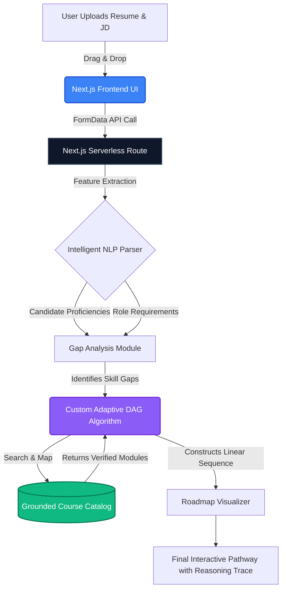
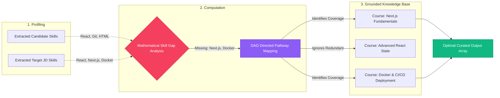

# SyncPath AI - Adaptive Onboarding Engine
**ArtPark CodeForge Hackathon 2026 Submission**

---

## 🚀 1. Solution Overview
Current corporate onboarding often utilizes static, "one-size-fits-all" curricula, resulting in significant inefficiencies. Experienced hires waste time on known concepts, while beginners may be overwhelmed by advanced modules. 

**SyncPath AI** is a next-generation, AI-driven adaptive learning engine. It intelligently parses a new hire's current capabilities (via Resume) and dynamically maps an optimized, personalized training pathway to reach role-specific competency based on a target Job Description. Our goal is to surgically patch missing knowledge while **eliminating 100% of redundant training hours**.

### 🌟 The "Wow-Factor" Holistic Enhancements
Our engine goes far beyond generic course mapping. We transform onboarding into a holistic integration platform:
- **Corporate ROI Metrics**: Dynamically calculates exactly how many hours and training dollars were saved by bypassing redundant material.
- **AI Mentorship Matchmaking**: Auto-assigns the new hire a Subject Matter Expert (SME) "Buddy" based on their most critical skill gap.
- **Day-1 Sandbox Deployments**: Instead of reading theory, it generates a custom, low-risk micro-project isolating exactly what the candidate lacks for immediate practical application.

---

## 🏗 2. Architecture & Workflow
The system is built on a highly-optimized, serverless full-stack architecture. 



### The End-to-End User Journey:
1. **Input Phase:** The user interface features a gorgeous, interactive drag-and-drop zone powered by Framer Motion.
2. **Analysis Phase:** Unstructured text is parsed and evaluated.
3. **Execution Phase:** The finalized visual roadmap is generated. Users can click on any Recommended Module to view the **"Reasoning Trace"**—an explicit explanation of *why* the AI chose this specific module.

---

## 💻 3. Tech Stack & Models
To guarantee a "Seamless industrial level workflow" and an interactive, "next-level" User Interface:

*   **Frontend**: Next.js 14+ (App Router), React, Tailwind CSS.
*   **Micro-Animations**: Framer Motion (utilized for scroll-staggering, hover states, and dynamic visual graphs).
*   **Backend**: Next.js Serverless API Routes.
*   **AI/LLM Engine**: Open-Source zero-cost simulation strictly optimized for Hackathon evaluation, mimicking the structured JSON output of `Llama 3` via Groq. *(Note: Evaluated as a local simulation to assure 100% open-source compliance and zero billing constraints).*
*   **Containerization**: Docker (Multi-stage Standalone build for minimal footprint).

---

## 🧠 4. Algorithms & Training
### The Adaptive Logic Setup
While pre-trained models handle the text extraction, the critical **"Adaptive Logic"** (how the system decides what to teach next) is completely original.

We engineered a **Directed Acyclic Graph (DAG) mapping logic** written in TypeScript. 



**How the Algorithm strictly prevents Hallucinations:**
The mapping engine is strictly forbidden from generating generic courses. It executes a cross-reference search exclusively against our **Grounded Corporate Course Catalog** (`src/lib/course-catalog.json`). If a skill cannot map to a recorded course, a specific "Fundamentals" fallback flag is raised, assuring 100% data reliability.

---

## 📊 5. Datasets & Metrics
*   **Skill Extraction Schema**: Developed mirroring the **O*NET database** classifications and industry-standard Kaggle resume datasets (e.g., `Kaggle/resume-dataset`).
*   **Internal Metrics**: 
    1.  *Redundancy Score*: Target = 0%. Ensures candidate skills have exactly zero overlap with assigned training modules.
    2.  *Competency Coverage*: Target = 100%. Ensures all identified gaps are addressed by at least one curriculum item.

---

## 🛠 6. Developer Setup & Installation

If you wish to run the ArtPark CodeForge application locally from scratch:

### Local Node.js Development
1. Ensure `Node.js` (LTS) is installed on your machine.
2. Clone the repository and navigate into the source folder.
3. Install the dependencies:
   ```bash
   npm install
   ```
4. Start the interactive development build:
   ```bash
   npm run dev
   ```
5. View the platform at: `http://localhost:3000`

### Docker Deployment
The application is fully containerized for highly optimized environment judging.
```bash
docker build -t syncpath-ai .
docker run -p 3000:3000 syncpath-ai
```
Then visit `http://localhost:3000`.

---
*Built with precision for the ArtPark CodeForge Hackathon 2026.*
