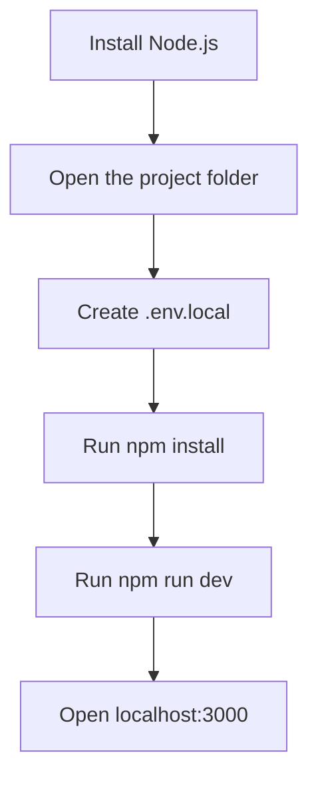

# CogniSync AI Team Setup Guide

This guide is for a teammate who wants to run the project locally without digging through the codebase.

## What the Project Does

The app takes:

- a resume file or pasted resume text
- a target job description

It then:

- extracts relevant skills from both inputs
- compares current capability against role expectations
- generates a grounded onboarding roadmap

## Before You Start

You need:

- the full project folder
- Node.js installed
- internet access for the first `npm install`
- optionally, a Groq API key

The app still works without a Groq key. In that case it uses deterministic local parsing only.

## Quick Start



## Step 1: Install Node.js

1. Open `https://nodejs.org`
2. Download the `LTS` version
3. Run the installer with the default options
4. Close and reopen your terminal

Check the installation:

```bash
node -v
```

If you see a version number, Node.js is ready.

## Step 2: Open the Project Folder

Make sure the folder contains:

- `package.json`
- `README.md`
- `.env.example`
- `TEAM_SETUP_GUIDE.md`

## Step 3: Create `.env.local`

Copy `.env.example` and rename the copy to `.env.local`.

Expected contents:

```bash
GROQ_API_KEY=your_groq_api_key_here
GROQ_MODEL=llama-3.3-70b-versatile
```

You can use either setup below.

### Option A: Run with Groq

Add your real key:

```bash
GROQ_API_KEY=gsk_your_real_key_here
GROQ_MODEL=llama-3.3-70b-versatile
```

### Option B: Run without Groq

Leave the key unset or remove it. The app will continue in deterministic mode.

## Step 4: Get a Groq API Key

If you want the optional structured refinement mode:

1. Open `https://console.groq.com`
2. Sign in
3. Open `API Keys`
4. Create a key
5. Copy it into `.env.local`

Do not commit `.env.local`.

## Step 5: Open a Terminal in the Project Folder

### Windows

1. Open the project folder in File Explorer
2. Click the address bar
3. Type `powershell`
4. Press Enter

### macOS or Linux

1. Open Terminal
2. Run `cd <project-folder-path>`

## Step 6: Install Dependencies

Run:

```bash
npm install
```

Wait until the installation finishes.

## Step 7: Start the App

Run:

```bash
npm run dev
```

Then open:

```text
http://localhost:3000
```

## Step 8: Use the App

1. Open the homepage
2. Click `Open Analyzer`
3. Upload a resume file or paste resume text
4. Paste the target job description
5. Click `Formulate Pathway`
6. Review the generated output:
   - candidate profile
   - role requirements
   - skill gap matrix
   - staged roadmap
   - radar chart
   - mentor recommendation
   - calendar export

## Optional Health Checks

If you want to confirm the project is working cleanly:

```bash
npm run lint
npm run build
npm run verify:logic
```

What they do:

- `npm run lint` checks code style and static issues
- `npm run build` verifies production compilation
- `npm run verify:logic` runs scenario checks against the adaptive logic

## Docker

If Docker Desktop is installed:

```bash
docker build -t cognisync-ai .
docker run -p 3000:3000 -e GROQ_API_KEY=your_groq_api_key_here cognisync-ai
```

Then open `http://localhost:3000`.

## Common Problems

### `npm` is not recognized

Cause:

- Node.js is not installed correctly

Fix:

- reinstall Node.js
- reopen the terminal
- run `node -v` again

### The app opens but analysis looks basic

Cause:

- no Groq key is configured

Fix:

- add a Groq key to `.env.local`

### Port 3000 is already in use

Fix:

- close the other app using port 3000
- then run `npm run dev` again

### Resume upload fails

Check:

- the file is PDF, DOCX, or TXT
- the file is under 5 MB
- the file is not corrupted

### Build behaves strangely after changes

Run:

```bash
npm run clean
npm run build
```

## Stopping the App

In the terminal where the app is running, press:

```bash
Ctrl + C
```

## Final Reminder

Never upload `.env.local` to GitHub.
