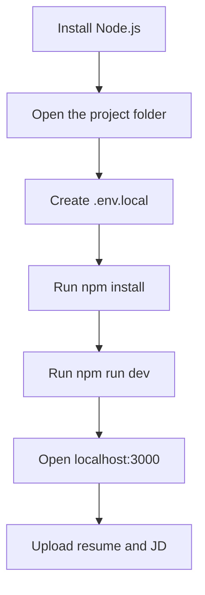
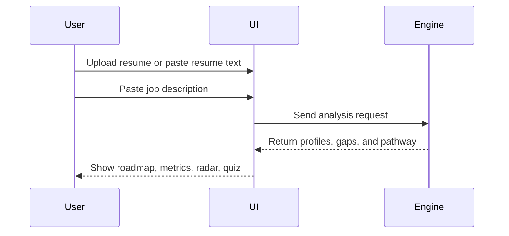

# CogniSync AI Team Setup Guide

This guide is written for a teammate with little or no technical background. Follow the steps in order and you will be able to run the project locally.

## What This Project Does

CogniSync AI reads:

- a candidate resume
- a target job description

Then it:

- extracts skills from both
- finds the real gap
- generates a custom training roadmap

## Quick Setup Flow



## Before You Start

You need:

- the full project folder
- internet for the first installation
- Node.js installed
- optionally, a free Groq API key

Important:

- the app can still run without a Groq key
- without a Groq key, it uses deterministic local parsing

## Step 1: Install Node.js

1. Open `https://nodejs.org`
2. Download the `LTS` version
3. Run the installer
4. Keep the default options
5. Finish installation
6. Close and reopen your terminal

To check that Node.js is installed:

```bash
node -v
```

If you see a version number, Node.js is ready.

## Step 2: Open the Project Folder

Make sure the folder contains at least these files:

- `package.json`
- `README.md`
- `.env.example`
- `TEAM_SETUP_GUIDE.md`

## Step 3: Create the Local Environment File

Inside the project folder:

1. Find `.env.example`
2. Make a copy
3. Rename the copy to `.env.local`

Open `.env.local`.

It should look like this:

```bash
GROQ_API_KEY=your_groq_api_key_here
GROQ_MODEL=llama-3.3-70b-versatile
```

You have 2 options:

### Option A: Run with Groq

Replace the placeholder key with your real key.

Example:

```bash
GROQ_API_KEY=gsk_your_real_key_here
GROQ_MODEL=llama-3.3-70b-versatile
```

### Option B: Run without Groq

Leave the file empty or remove the key line.

The app will still work in deterministic mode.

## Step 4: Get a Free Groq API Key

If you want the optional AI refinement mode:

1. Open `https://console.groq.com`
2. Sign in
3. Open `API Keys`
4. Click `Create API Key`
5. Copy the key
6. Paste it into `.env.local`

Do not commit `.env.local` to GitHub.

## Step 5: Open a Terminal in the Project Folder

### Windows

1. Open the project folder in File Explorer
2. Click the address bar
3. Type `powershell`
4. Press Enter

### Mac or Linux

1. Open Terminal
2. Type `cd `
3. Drag the project folder into the terminal
4. Press Enter

## Step 6: Install Project Dependencies

Run:

```bash
npm install
```

Wait for the installation to finish.

## Step 7: Start the App

Run:

```bash
npm run dev
```

When the terminal says the server is ready, open this in your browser:

```text
http://localhost:3000
```

## Step 8: How To Use The App

### Recommended Demo Flow



### Actual Usage Steps

1. Open the homepage
2. Click `Open Analyzer`
3. Either:
   - upload a resume file in PDF, DOCX, or TXT
   - or paste resume text
4. Paste the target job description
5. Click `Formulate Pathway`
6. Review:
   - candidate profile
   - role requirements
   - skill gap matrix
   - staged roadmap
   - radar chart
   - mentor recommendation
   - calendar export

## Step 9: Optional Quality Checks

If you want to confirm the project is healthy before sharing it:

```bash
npm run lint
npm run build
npm run verify:logic
```

What they mean:

- `npm run lint` checks code style issues
- `npm run build` checks production compilation
- `npm run verify:logic` checks adaptive logic against demo scenarios

## Docker Option

If Docker Desktop is installed:

```bash
docker build -t cognisync-ai .
docker run -p 3000:3000 -e GROQ_API_KEY=your_groq_api_key_here cognisync-ai
```

Then open:

```text
http://localhost:3000
```

## Common Problems And Fixes

### Problem: `npm` is not recognized

Cause:

- Node.js is not installed properly

Fix:

- reinstall Node.js
- reopen the terminal
- run `node -v` again

### Problem: The app opens but the analysis looks basic

Cause:

- no Groq key is present

Fix:

- add a free Groq key to `.env.local`

Also note:

- deterministic mode is still valid and expected to work

### Problem: Port 3000 is already in use

Fix:

- close the other app using port 3000
- or restart your machine
- then run `npm run dev` again

### Problem: Resume upload fails

Check:

- the file is PDF, DOCX, or TXT
- the file is under 5 MB
- the file is not corrupted

### Problem: Build works once but later acts strange

Run:

```bash
npm run clean
npm run build
```

## Stopping The App

In the terminal where the app is running, press:

```bash
Ctrl + C
```

## Final Reminder

Never upload `.env.local` to GitHub.
