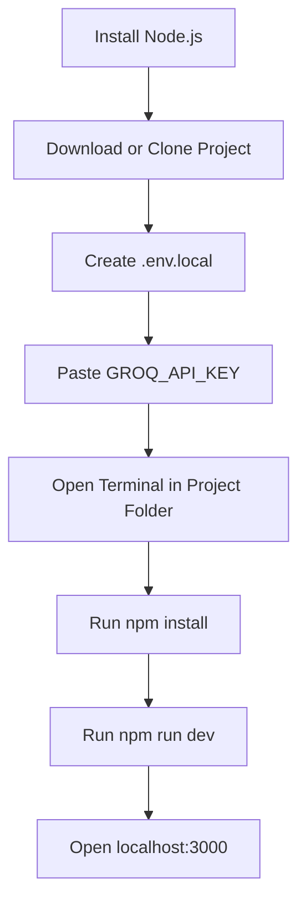
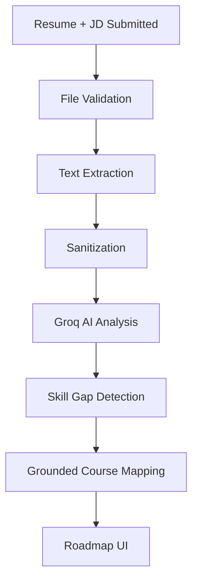

# CogniSync AI - Detailed Team Setup Guide

Welcome. This guide is written for a teammate who may have little or no technical experience.

If you follow the steps exactly in order, you should be able to run the full project from scratch on your computer.

---

## What This Project Needs Before It Can Run

Our project depends on four things:

1. **Project files** on your machine
2. **Node.js** installed
3. **A free Groq API key**
4. **A terminal opened in the project folder**

---

## Quick Overview Before We Start

Here is the full setup flow:



---

## Step 1: Get a Free Groq API Key

CogniSync AI uses Groq to run the AI model for:

- skill extraction
- gap analysis
- quiz generation

Without this key, the UI may still load, but the real AI functionality will not work properly.

### Do this:

1. Open this website: `https://console.groq.com`
2. Sign in using Google or create a free account
3. After logging in, open the **API Keys** section
4. Click **Create API Key**
5. Give it any name you like, for example: `hackathon`
6. Copy the generated key

It will look something like:

```text
gsk_xxxxxxxxxxxxxxxxxxxxxxxxxxxxxxxxx
```

Keep that copied somewhere safe for the next steps.

---

## Step 2: Install Node.js

Node.js is the runtime needed to run this project locally.

### Do this:

1. Open `https://nodejs.org`
2. Download the **LTS** version
3. Open the installer
4. Keep clicking **Next** with the default settings
5. Finish installation

### Important:

After installing Node.js:

- close all old terminals
- open a fresh terminal window

### Check if Node.js is working

Run:

```bash
node -v
```

If it shows something like `v20.x.x`, then Node.js is installed correctly.

You can also check npm:

```bash
npm -v
```

---

## Step 3: Get the Project Files

There are usually two ways:

### Option A: GitHub

If the repository is on GitHub:

```bash
git clone <repository-url>
```

### Option B: ZIP File

If you received a ZIP:

1. Download the ZIP
2. Right-click it
3. Click **Extract All**
4. Save it somewhere easy to find, such as Desktop or Documents

### After that

Open the project folder and make sure you can see files like:

- `package.json`
- `README.md`
- `.env.example`
- `src/`

---

## Step 4: Create the Local Environment File

This step tells the app what Groq API key to use.

### Do this:

1. Find the file called `.env.example`
2. Copy it
3. Paste it in the same folder
4. Rename the copy to exactly:

```text
.env.local
```

### Then open `.env.local`

Inside you should see:

```bash
GROQ_API_KEY=your_groq_api_key_here
```

Replace it with your real key:

```bash
GROQ_API_KEY=gsk_your_real_key_here
```

Then save the file.

### Important safety note

Never upload `.env.local` to GitHub.  
It contains your private API key.

---

## Step 5: Open the Terminal Inside the Project Folder

This is important. The terminal must point to the project folder.

### On Windows

1. Open the project folder in File Explorer
2. Click the address bar at the top
3. Remove the existing text
4. Type:

```text
cmd
```

5. Press Enter

A terminal window will open directly inside the project folder.

### On Mac or Linux

1. Open Terminal
2. Type `cd ` with a space after it
3. Drag the project folder into the terminal
4. Press Enter

---

## Step 6: Install Project Dependencies

Now we install all required packages.

Run:

```bash
npm install
```

### What this does

It downloads all libraries the project uses, such as:

- Next.js
- React
- Tailwind CSS
- Groq SDK
- Recharts
- PDF and DOCX parsing libraries

### Wait for it to finish

This can take anywhere from 1 to 5 minutes depending on internet speed.

---

## Step 7: Start the Development Server

After `npm install` finishes, run:

```bash
npm run dev
```

After a few seconds, you should see something similar to:

```text
Local: http://localhost:3000
```

That means the app is running.

---

## Step 8: Open the App in Your Browser

Open any browser:

- Chrome
- Edge
- Firefox

Then go to:

```text
http://localhost:3000
```

Now the project should load.

---

## Step 9: How to Use the App

Once the app is open:

1. Open the landing page
2. Click the upload button
3. Upload a resume file
4. Paste the job description in the text box
5. Click **Formulate Pathway**
6. Wait while the AI analyzes the profile
7. Review the generated roadmap

You can also:

- inspect the candidate vs required skill profiles
- view the role readiness score
- see the skill radar chart
- take AI-generated module quizzes
- export the roadmap to calendar

---

## Supported Resume File Types

The current app supports:

- `.pdf`
- `.docx`
- `.txt`

### File size limit

The real enforced limit is:

```text
5 MB maximum
```

If the file is larger than this, the upload will fail.

---

## What the App Does Internally

So your teammate understands what is happening:



The app:

- extracts skills from the resume
- extracts required skills from the JD
- compares both
- identifies missing competencies
- maps missing skills to verified modules from the internal catalog

---

## Common Problems and Fixes

### Problem: `node` or `npm` is not recognized

**Cause:** Node.js is not installed correctly.

**Fix:**

1. Reinstall Node.js
2. Close old terminal windows
3. Open a new terminal
4. Run:

```bash
node -v
npm -v
```

---

### Problem: The app opens, but AI analysis does not work

**Cause:** `.env.local` is missing or the API key is wrong.

**Fix:**

1. Open `.env.local`
2. Check that `GROQ_API_KEY=` exists
3. Confirm the pasted key is valid
4. Restart the server after saving

Stop and restart:

```bash
Ctrl + C
npm run dev
```

---

### Problem: Resume upload fails

**Cause:** unsupported file type or file too large.

**Fix:**

- use PDF, DOCX, or TXT only
- keep the file below 5 MB

---

### Problem: Port 3000 is already being used

**Cause:** another local app is running on that port.

**Fix:**

Stop the other app if possible, or run this project on another port.

---

### Problem: `npm install` fails

**Cause:** internet issue, Node version issue, or corrupted npm cache.

**Basic fix:**

1. Check your internet
2. Confirm Node is installed
3. Try again:

```bash
npm install
```

---

## How to Stop the Project

When finished, go to the terminal and press:

```bash
Ctrl + C
```

This will stop the running local server.

---

## Optional: Run with Docker Instead

If Docker Desktop is already installed, the app can also be run this way:

```bash
docker build -t cognisync-ai .
docker run -p 3000:3000 -e GROQ_API_KEY=your_groq_api_key_here cognisync-ai
```

Then open:

```text
http://localhost:3000
```

---

## Final Checklist

Before asking for help, confirm all of these:

- Node.js is installed
- npm is working
- project files are downloaded
- `.env.local` exists
- `GROQ_API_KEY` is pasted correctly
- `npm install` completed successfully
- `npm run dev` is running
- browser is opened at `http://localhost:3000`

---

## If You Need Help

When asking for help, send:

1. a screenshot of the terminal
2. the exact error message
3. a screenshot of the browser if the UI looks broken

That will make troubleshooting much faster.
